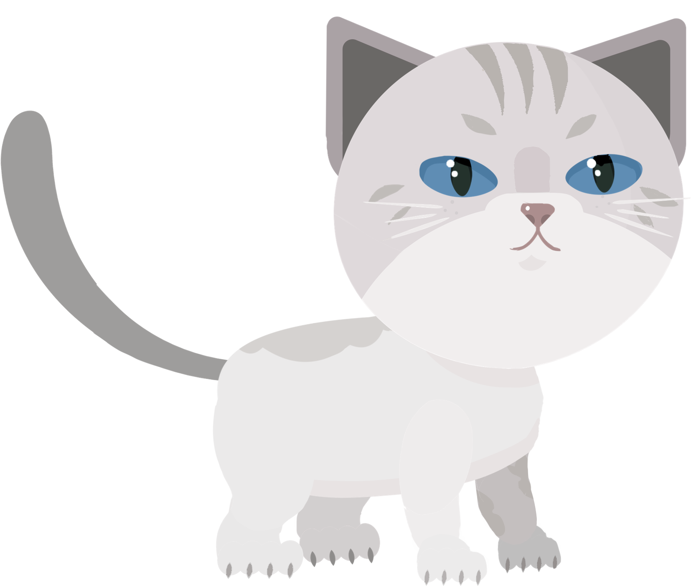

 

 

 One of my first Unity games – <b>2021</b>

#

 

 

 

My first Unity game in 2021 about amusing adventures of my cat Oscar. 

<!-- 
Это аркадный 2D платформер. В процессе разработки использовался в большом объеме материал по программированию и алгоритмизации. Были отработаны навыки владения методами надежного программирования и эффективности разработки в Visual Studio с использованием C# и Unity.

 

## Relevance

Self-isolation and quarantine alongside the drastic change of established daily routine has resulted in **ignorance and messiness** of business and task planning. The pace of life today has increased so much that keeping everything in one head is almost impossible. Excluding current circumstances, this application doesn't lose its usefulness. For a person working in any company, it's necessary to `keep track of his business` and make sure not to miss out anything, as an example. In fact, every omission can be fraught with financial cost.

 

## Issues
  - Help user to manage the tasks properly
  - Build the functional, information and graphic application architectures
  - Provide the neat and intuitive to the user interface 
  - Develop the necessary structured algorithms

 

## Resolving
Following an already proven **Kanban system**, three groups of tasks were provided for the user. That will enable view the state of all tasks at a given time. You can be guided by number of your tasks for today and number of all tasks in the total tailored to your needs and free time so you can determine the task load of current day. Use `importance level of task` for easy task sorting. Add a task `description` or set a `deadline` if it's needed. 

 

## Demonstration
https://user-images.githubusercontent.com/68112632/203307632-ef283c07-9208-4e62-bf9b-f08fb0ae5ad5.mp4

 

## Conclusion
Having studied and analyzed all the information about the user's needs, it was possible to clearly determine what exactly in this application should be gathered for the proper tasks organization. **The main pillar** and **foundation** of the development was providing the user with **free of actions** and allowing to use his discretion by giving him everything necessary for the best planning and task organization. There is no tight binding to `user task` definition. This makes it possible to adding and creating lists/schedule consisting of **whatever you want**. For example, `shopping list`, `movies list`, `book list`, `projects and ideas`...

 

## Download
Download [Leaderplan.rar](https://drive.google.com/file/d/1UVoRCXbue57vktzYM24p5obLC7CqA5Qn/view?usp=sharing)

-->
